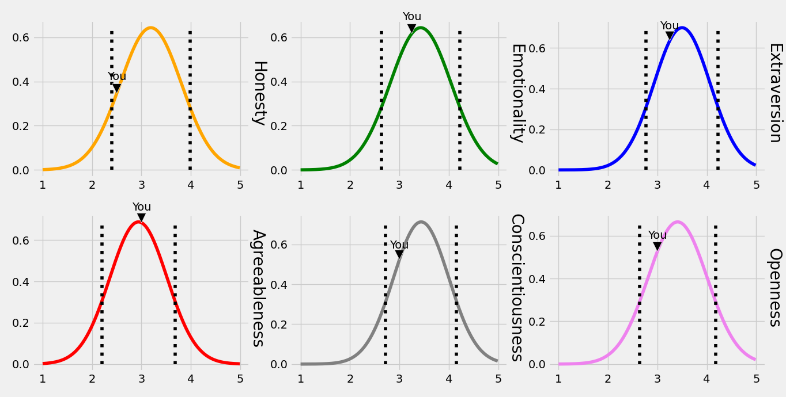

# HEXACO Person

## Background

The study of personality and its transformation is a rather complicated topic.
What exactly constitutes the factor people usually refer to as personality is a
common question that used to be a hard one to answer in the field of
psychology. The fundamental lexical hypothesis provides a scientific framework
by which it is possible to formulate sufficient models to describe
personalities. The hypothesis is founded upon two axioms: 1) personality traits
that are significantly important will eventually become a part of language, and
2) significantly more important personality traits are more likely to be
represented into language as a single word.

As a result of this framework, and with the use of statistical tools i.e.
factor analysis, the Big Five model has emerged. It described one's personality
using, obviously, five factors: openness to experience, conscientiousness,
extraversion, agreeableness, neuroticism. Since then, uncountable papers have
been written that studies the different proprieties of the model and its
relation with other factors. Furthermore, there have been a number of papers
that works on developing the model (e.g. NEO Personality Inventory-Revised, Big
Five Aspect Scale, Abridged Big Five Circumplex).

Despite that, these works focused on the original five dimensions and did not
consider the possibility of an unnoticed personality traits; the HEXACO model
tackles this issue. Through more studies across different languages, and with
even more factor analysis tuning, it was possible find a sixth personality
trait. The new trait was later named *Honesty—Humbleness* (usually referred to
as just H).

The 'H factor' model was able to provide a more detailed relevant personality
description. However, due to its relative recency, it is still severely lacking
in terms of software that utilizes its advantages. As such, this simple
collection of extensible Python scripts were created. The tools aim to be a
helpful step towards more advanced creations of programmatic creativity.

## Usage

`python3 take-test.py /path/to/answers.csv`

`python3 calculate-results.py /path/to/answers.csv /path/to/results.csv`

`python3 plot.py /path/to/results.csv`

## References

Lee, K., & Ashton, M. C. (2012). *The H factor of personality*. Wilfrid Laurier University Press.

Lee, K., & Ashton, M. C. (2016). Psychometric Properties of the HEXACO-100. *Assessment*, 25(5), 543–556. https://doi.org/10.1177/1073191116659134
